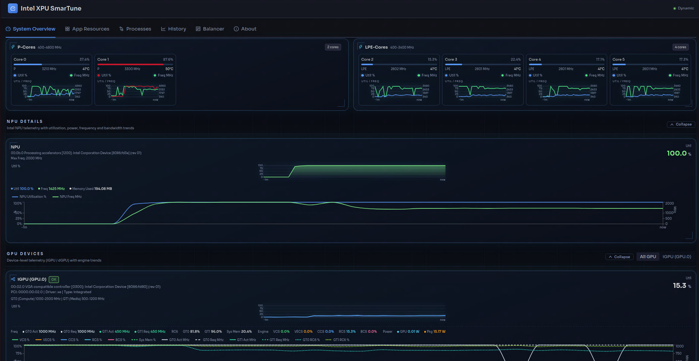
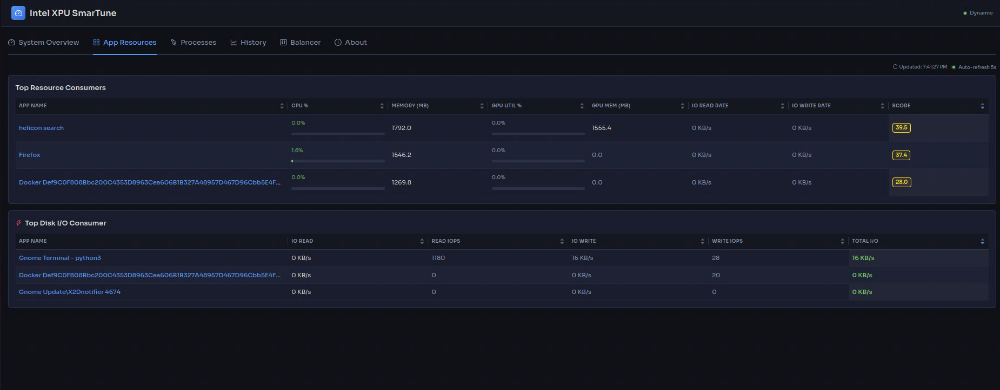
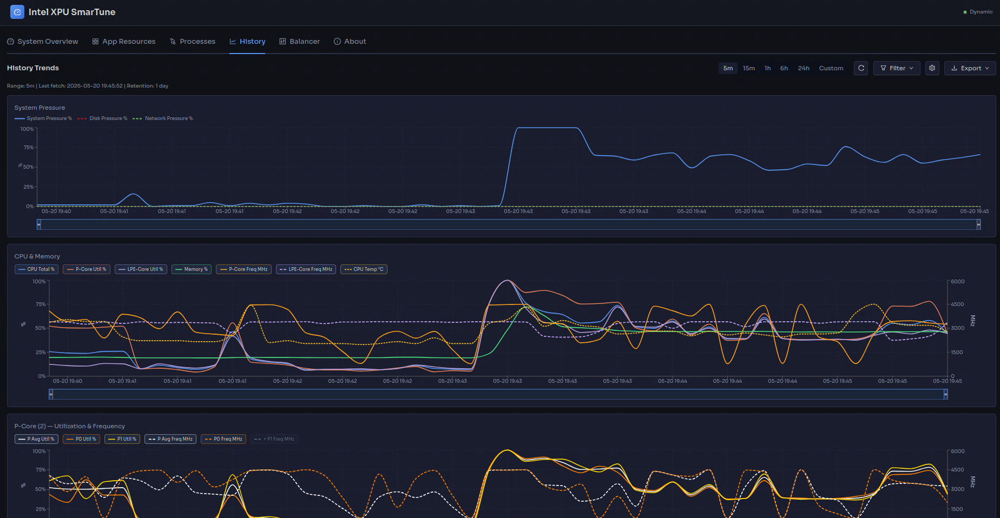

# Intel XPU SmarTune

## Overview

Intel XPU SmarTune is a collection of platform tools and services designed to optimize and enhance the system operational efficiency of AI NAS, it comprises several components：SystemOvewview(monitor and systemPressure), App Resources, Processes, History, Balancer, About.

- Balancer [User Guide](https://github.com/intel/intel-xpu-smartune/tree/main/balancer#readme) is designed primarily for platform resource governance and application priority management.

## License

Each component of the Edge Infrastructure external is licensed under [Apache 2.0][apache-license].

[apache-license]: https://www.apache.org/licenses/LICENSE-2.0

## Architecture:

### SmarTune 1.5 Overall Architecture


## Requirement:
    1.Verified Platforms:
        MTL, PTL and WideCat Lake
        Ubuntu / debian
        Python 3.12
    2. Dependencies:
        - bcc
        - cpupower

## Key Features:

### 1. Resource Control
Dynamically restricts CPU, memory, and disk I/O resource usage for the most resource-intensive applications via cgroups v2 when system resources are strained. Switches power modes according to pressure levels and gradually restores resource quotas as pressure eases.
- cgroups v2 resource control: CPU quota, memory.high, I/O weight (io.weight), and per-disk read/write throughput and IOPS throttling (io.max: rbps/wbps/riops/wiops) per app
- CPU frequency governor switching (powersave/performance) based on pressure level

### 2. Pressure Monitoring
Real-time collection of CPU, memory, and I/O pressure data based on Linux PSI (Pressure Stall Information), computing a composite score and classifying it into four pressure levels (low/medium/high/critical). Intercepts execve system calls via eBPF to detect controlled app launches and exits in real-time, while independently monitoring disk I/O utilization and system iowait.
- PSI-based pressure monitoring (CPU/memory/I/O) with four levels: low/medium/high/critical
- eBPF (via BCC) execve interception for real-time app launch/exit detection
- Disk I/O stress detection and top disk consumer throttling

### 3. Priority Queue
When system pressure reaches critical level or disk I/O is busy, new app launch requests are suspended and inserted into a max-priority queue. Once resources recover, queued apps are automatically launched in priority order, with support for manual cancellation of queued launches.
- Max-priority queue for deferred app launches under resource contention
- Auto-launch queued apps in priority order when resources recover
- Manual cancellation support for pending launches

### 4. Keep-Alive
Reduces the likelihood of Critical-priority controlled apps being killed by the system OOM Killer while continuously monitoring critical app processes to ensure stable operation.
- Keep-alive for Critical apps via oom_score_adj tuning
- Continuous monitoring of critical app processes to ensure stability

### 5. Disk I/O Control
Restricts applications that consume excessive disk I/O resources via cgroups v2, allocating read/write bandwidth and IOPS quotas based on priority, and gradually restoring limits as disk I/O pressure subsides.
- Per-disk read/write throughput and IOPS throttling via cgroups v2
- Priority-based bandwidth and IOPS quota allocation
- Progressive restoration as I/O pressure decreases

### 6. Network I/O Control
Implements ingress and egress traffic control for controlled apps via cgroup + iptables + tc/HTB, allocating bandwidth across four priority classes (Critical/High/Low/System). Calculates network pressure levels in real-time based on a moving average window, sequentially limiting bandwidth ceiling for low/high priority classes when pressure reaches critical level, and progressively restoring as pressure drops.
- tc/HTB + iptables + cgroup network traffic shaping with four priority classes (Critical/High/Low/System)
- Real-time network pressure calculation with moving average window
- Dynamic bandwidth ceiling adjustment based on pressure level
- Progressive bandwidth restoration as network pressure decreases

### 7. GPU Real-time Monitoring
Real-time collection of metrics for each GPU card (iGPU/dGPU automatically distinguished): gt0/gt1 frequency (current/actual/max), GPU and package power consumption, per-engine utilization (Render/Compute/Video Encode/Decode/Copy), VRAM usage, and throttle reason detection. Static info includes GPU names, engine list, EU count, PCIe speed/width, and PCI addresses.
- Per-card gt0/gt1 frequency, power, engine utilization (Render/Compute/Video Encode/Decode/Copy)
- VRAM usage and throttle reason detection
- Static info: GPU names, engine list, EU count, PCIe speed/width, PCI addresses
- Automatic iGPU/dGPU distinction

### 8. NPU Real-time Monitoring
Real-time reading of NPU utilization (%), power (W), temperature (°C), operating frequency (MHz), NoC bandwidth (MiB/s), and memory usage. Per-process NPU memory usage tracking via /proc/[pid]/fdinfo for process-level NPU usage monitoring.
- NPU telemetry via Intel PMT: utilization, power, temperature, frequency, NOC bandwidth, memory utilization
- Per-process NPU tracking via fdinfo (intel_vpu driver, drm-resident-memory)
- Supports Intel MTL / ARL / LNL / PTL platforms
- Process-level NPU memory consumption tracking

### 9. System Information Collection
Static collection of complete hardware and software environment information: CPU model, P/E-core topology and frequency ranges; total memory and DDR speeds; disk device list and capacities; NIC count, primary NIC, and peak bandwidth; GPU names, engines, PCIe, frequency ranges, and EU count for each card; NPU PCI ID, driver version, firmware version, and frequency ranges; OS version, BIOS, kernel, and GuC/HuC/NPU firmware, Mesa/OpenCL/Level Zero/Media driver versions.
- Static hardware/software inventory: CPU topology (P/E-core), GPU static config, NPU device info
- OS/BIOS/kernel/driver versions (GuC, HuC, NPU FW, Mesa, OpenCL, Level Zero, Media)
- Complete network interface information with speeds and IP addresses
- Memory channel and slot configuration

### 10. Manual Control
Supports manual operations on controlled apps, including priority adjustment, cancellation of queued launches, resource limit configuration (CPU/memory/I/O), quota restoration, keep-alive settings, and app deletion.
- REST API and Web UI for manual app management (priority, limits, restore, delete)
- React dashboard with 6-tab UI: Performance, App Resources, Process Resources, Balancer, History, About
- Support for manual resource limit adjustment and restoration


## API Documentation

For a complete reference of all backend REST API endpoints, see the [Backend API Guide](docs/API_ENDPOINTS.md).

## Directory Structure:
```
intel-xpu-smartune/
├── docs/                        # API documentation (API_ENDPOINTS.md)
└── balancer/
    ├── BalanceService.py        # Flask REST API server; resource-balancing entry point
    ├── start_balancer.sh        # Convenience script to start the balancer service
    ├── balancer/                # Core balancing logic: DynamicBalancer, MaxPriorityQueue,
    │                            #   app-intercept loop, network controller integration
    ├── config/                  # config.yaml (thresholds, weights, app list) and config loader
    ├── controller/              # Resource controllers:
    │   ├── cpu.py               #   CPU quota (cgroups v2 cpu.max)
    │   ├── memory.py            #   Memory limits (memory.high / memory.max)
    │   ├── io.py                #   Disk I/O throttling (io.max rbps/wbps/riops/wiops)
    │   ├── network.py           #   Network traffic shaping (tc/HTB + iptables + cgroup)
    │   ├── governor.py          #   CPU frequency governor switching
    │   └── psi.py               #   PSI trigger-based resource reader
    ├── db/                      # Peewee ORM database model for controlled app records
    ├── monitor/                 # System monitoring components:
    │   ├── psi.py               #   Linux PSI reader
    │   ├── pressure.py          #   Pressure scoring and level classification
    │   ├── res_monitor.py       #   CPU/memory/disk/network resource usage and top-process finder
    │   ├── network.py           #   Network traffic sampling and pressure calculation
    │   ├── cgroup.py            #   cgroup path resolution and monitoring
    │   ├── appIntercept.py      #   eBPF-based app launch/exit detection (BCC)
    │   ├── app_discovery.py     #   "Add App" wizard: process search and field extraction
    │   ├── bpf_event.c          #   eBPF C program for execve/exit tracepoints
    │   ├── gpu_monitor.py       #   Intel GPU monitoring (i915/Xe PMU, RAPL, fdinfo)
    │   ├── npu_monitor.py       #   Intel NPU monitoring via PMT telemetry and fdinfo
    │   ├── system_info.py       #   Static/dynamic hardware & software info collection
    │   ├── metrics/             #   Per-subsystem metric collectors (cpu, gpu_perf, npu, history)
    │   └── monitor_api.py       #   Flask Blueprint exposing /monitor/* REST endpoints
    ├── test/                    # Feature test scripts (BPF, PSI, disk I/O, notifications)
    ├── utils/                   # Shared utilities: logger, app_utils, http_utils
    └── dashboard/               # React/TypeScript dashboard (6-tab UI: Performance,
                                 #   App Resources, Process Resources, Balancer, History, About)
```


## Demo Screenshots:

The following screenshots demonstrate SmarTune's real-time monitoring and resource balancing capabilities:

### Performance Overview


Real-time system performance monitoring dashboard showing CPU, GPU, NPU, memory, disk, and network metrics.

### App Resources

Controlled application resource usage - top3.

### Historical Data


Historical system pressure and resource utilization trends.

### Balancer Control

Dynamic resource balancing controls and priority queue management.

### System Information

Complete hardware and software configuration details.
