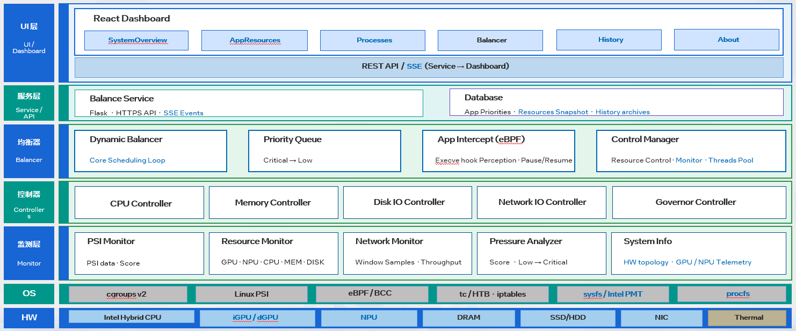
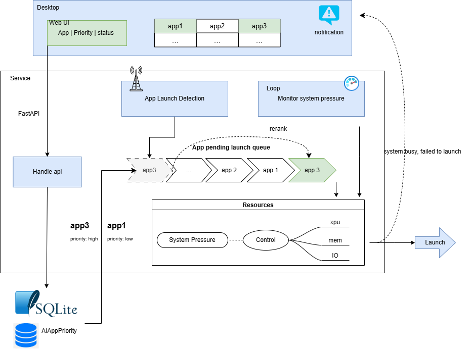
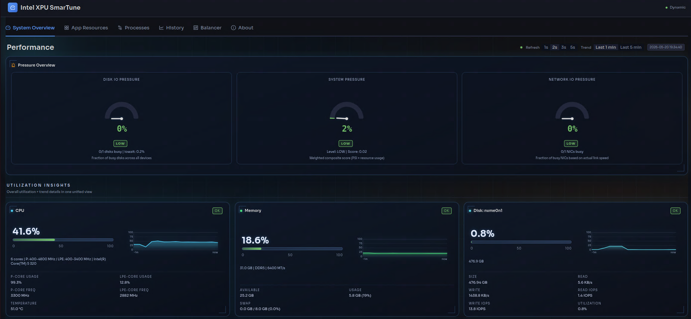
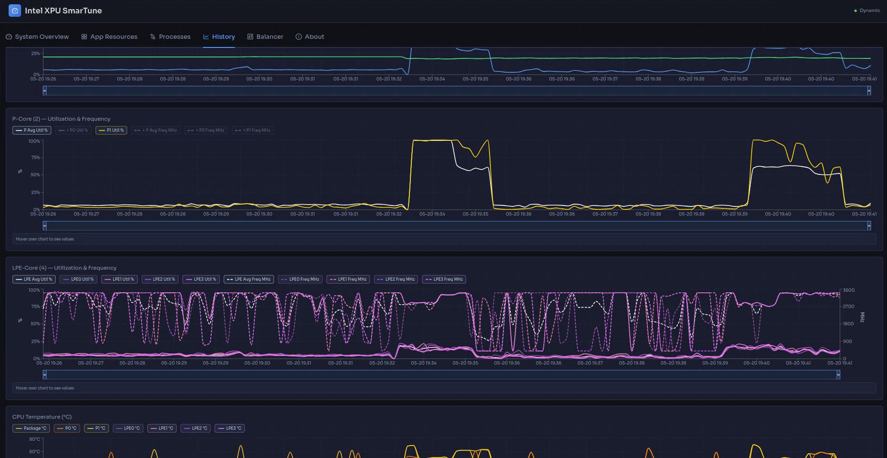
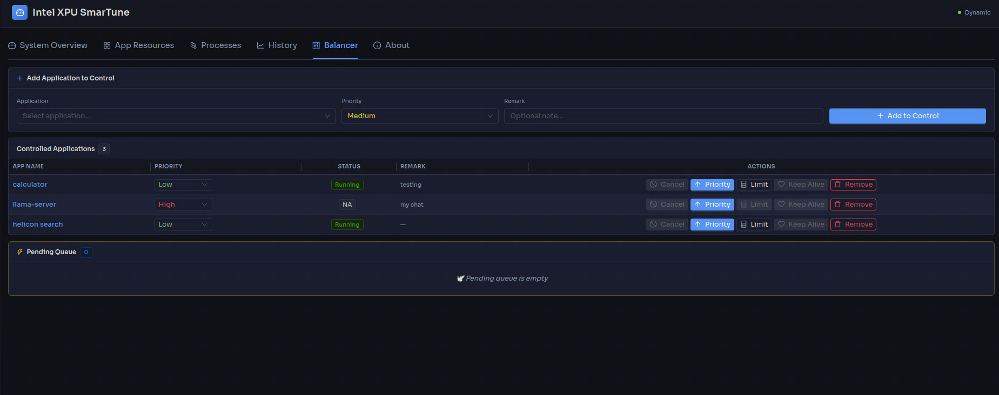
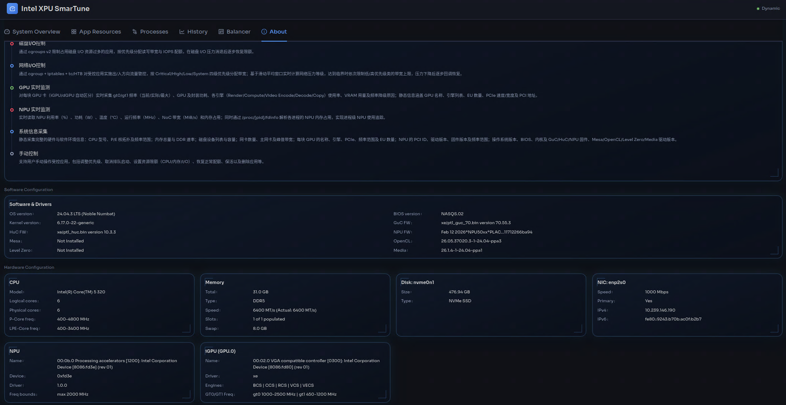

# Multi-task Resource Balancer & System Monitor (MRB)
MRB is a system-level service for AI NAS that combines real-time hardware monitoring
(CPU, GPU, NPU, memory, disk, and network) with dynamic multi-task resource balancing.
It intercepts application launches via eBPF, evaluates system pressure via Linux PSI,
and uses cgroups v2 to control CPU, memory, and I/O resources per app based on priority.

# Architecture:

## SmarTune 1.5 Overall Architecture


## Resource Balancing Flow


# Requirement:
    1.Verified Platforms:
        MTL, PTL and WideCat Lake
        Ubuntu / debian
        Python 3.12
    2. Dependencies:
        - bcc
        - cpupower

# Key Features:

## 1. Resource Control
Dynamically restricts CPU, memory, and disk I/O resource usage for the most resource-intensive applications via cgroups v2 when system resources are strained. Switches power modes according to pressure levels and gradually restores resource quotas as pressure eases.
- cgroups v2 resource control: CPU quota, memory.high, I/O weight (io.weight), and per-disk read/write throughput and IOPS throttling (io.max: rbps/wbps/riops/wiops) per app
- CPU frequency governor switching (powersave/performance) based on pressure level

## 2. Pressure Monitoring
Real-time collection of CPU, memory, and I/O pressure data based on Linux PSI (Pressure Stall Information), computing a composite score and classifying it into four pressure levels (low/medium/high/critical). Intercepts execve system calls via eBPF to detect controlled app launches and exits in real-time, while independently monitoring disk I/O utilization and system iowait.
- PSI-based pressure monitoring (CPU/memory/I/O) with four levels: low/medium/high/critical
- eBPF (via BCC) execve interception for real-time app launch/exit detection
- Disk I/O stress detection and top disk consumer throttling

## 3. Priority Queue
When system pressure reaches critical level or disk I/O is busy, new app launch requests are suspended and inserted into a max-priority queue. Once resources recover, queued apps are automatically launched in priority order, with support for manual cancellation of queued launches.
- Max-priority queue for deferred app launches under resource contention
- Auto-launch queued apps in priority order when resources recover
- Manual cancellation support for pending launches

## 4. Keep-Alive
Reduces the likelihood of Critical-priority controlled apps being killed by the system OOM Killer while continuously monitoring critical app processes to ensure stable operation.
- Keep-alive for Critical apps via oom_score_adj tuning
- Continuous monitoring of critical app processes to ensure stability

## 5. Disk I/O Control
Restricts applications that consume excessive disk I/O resources via cgroups v2, allocating read/write bandwidth and IOPS quotas based on priority, and gradually restoring limits as disk I/O pressure subsides.
- Per-disk read/write throughput and IOPS throttling via cgroups v2
- Priority-based bandwidth and IOPS quota allocation
- Progressive restoration as I/O pressure decreases

## 6. Network I/O Control
Implements ingress and egress traffic control for controlled apps via cgroup + iptables + tc/HTB, allocating bandwidth across four priority classes (Critical/High/Low/System). Calculates network pressure levels in real-time based on a moving average window, sequentially limiting bandwidth ceiling for low/high priority classes when pressure reaches critical level, and progressively restoring as pressure drops.
- tc/HTB + iptables + cgroup network traffic shaping with four priority classes (Critical/High/Low/System)
- Real-time network pressure calculation with moving average window
- Dynamic bandwidth ceiling adjustment based on pressure level
- Progressive bandwidth restoration as network pressure decreases

## 7. GPU Real-time Monitoring
Real-time collection of metrics for each GPU card (iGPU/dGPU automatically distinguished): gt0/gt1 frequency (current/actual/max), GPU and package power consumption, per-engine utilization (Render/Compute/Video Encode/Decode/Copy), VRAM usage, and throttle reason detection. Static info includes GPU names, engine list, EU count, PCIe speed/width, and PCI addresses.
- Per-card gt0/gt1 frequency, power, engine utilization (Render/Compute/Video Encode/Decode/Copy)
- VRAM usage and throttle reason detection
- Static info: GPU names, engine list, EU count, PCIe speed/width, PCI addresses
- Automatic iGPU/dGPU distinction

## 8. NPU Real-time Monitoring
Real-time reading of NPU utilization (%), power (W), temperature (°C), operating frequency (MHz), NoC bandwidth (MiB/s), and memory usage. Per-process NPU memory usage tracking via /proc/[pid]/fdinfo for process-level NPU usage monitoring.
- NPU telemetry via Intel PMT: utilization, power, temperature, frequency, NOC bandwidth, memory utilization
- Per-process NPU tracking via fdinfo (intel_vpu driver, drm-resident-memory)
- Supports Intel MTL / ARL / LNL / PTL platforms
- Process-level NPU memory consumption tracking

## 9. System Information Collection
Static collection of complete hardware and software environment information: CPU model, P/E-core topology and frequency ranges; total memory and DDR speeds; disk device list and capacities; NIC count, primary NIC, and peak bandwidth; GPU names, engines, PCIe, frequency ranges, and EU count for each card; NPU PCI ID, driver version, firmware version, and frequency ranges; OS version, BIOS, kernel, and GuC/HuC/NPU firmware, Mesa/OpenCL/Level Zero/Media driver versions.
- Static hardware/software inventory: CPU topology (P/E-core), GPU static config, NPU device info
- OS/BIOS/kernel/driver versions (GuC, HuC, NPU FW, Mesa, OpenCL, Level Zero, Media)
- Complete network interface information with speeds and IP addresses
- Memory channel and slot configuration

## 10. Manual Control
Supports manual operations on controlled apps, including priority adjustment, cancellation of queued launches, resource limit configuration (CPU/memory/I/O), quota restoration, keep-alive settings, and app deletion.
- REST API and Web UI for manual app management (priority, limits, restore, delete)
- React dashboard with 6-tab UI: Performance, App Resources, Process Resources, Balancer, History, About
- Support for manual resource limit adjustment and restoration


# Directory Structure:
```
    multi-task-resource-balancer/
    ├── BalanceService.py        # Flask REST API server; resource-balancing entry point
    ├── start_balancer.sh        # Convenience script to start the balancer service
    ├── balancer/                # Core balancing logic: DynamicBalancer, MaxPriorityQueue,
    │                            #   app-intercept loop, network controller integration
    ├── config/                  # config.yaml (thresholds, weights, app list) and config loader
    ├── controller/              # Resource controllers: CPU quota, memory, Disk I/O,
    │                            #   network (tc/HTB), CPU governor, PSI reader
    ├── db/                      # Peewee ORM database model for controlled app records
    ├── monitor/                 # System monitoring components:
    │   ├── psi.py               #   Linux PSI reader
    │   ├── pressure.py          #   Pressure scoring and level classification
    │   ├── res_monitor.py       #   CPU/memory/disk/network resource usage and top-process finder
    │   ├── network.py           #   Network traffic sampling and pressure calculation
    │   ├── cgroup.py            #   cgroup path resolution and monitoring
    │   ├── appIntercept.py      #   eBPF-based app launch/exit detection (BCC)
    │   ├── bpf_event.c          #   eBPF C program for execve syscall interception
    │   ├── system_info.py       #   Static/dynamic hardware & software info collection
    │   │                        #   (CPU, GPU, NPU, memory, disk, network, driver versions)
    │   ├── intel_npu_smi.py     #   Intel NPU monitoring via PMT telemetry and fdinfo
    │   └── monitor_api.py       #   Flask Blueprint exposing /monitor/* REST endpoints
    ├── tools/                   # External tools and utilities
    ├── test/                    # Unit / integration tests and feature test scripts
    ├── utils/                   # Shared utilities: logger, app_utils, http_utils
    ├── dashboard/               # React/TypeScript dashboard (6-tab UI: Performance,
    │                            #   App Resources, Process Resources, Balancer, History, About)
```

# System Control & Resource Balancing:
The system control and monitoring module is designed to balance multiple AI apps running concurrently on NAS.
Its core mechanisms are as follows:
```
1. Control: When system resources are strained, dynamically restrict the top resource-consuming apps'
    CPU quota, memory.high, I/O weight (io.weight), and per-disk read/write throughput and IOPS
    limits (io.max: rbps/wbps/riops/wiops) via cgroups v2, while switching the CPU frequency governor
    (powersave/performance) according to pressure level. Resources are gradually restored once pressure drops.
2. Monitor: Collect CPU, memory, and I/O Pressure Stall Information (PSI) in real time, compute a
    composite pressure score, and map it to four levels (low/medium/high/critical). Intercept controlled
    app launches and exits via eBPF (execve hook). Independently detect disk I/O stress and identify
    the top disk I/O consumers.
3. Priority Queue: When pressure reaches critical level or disk I/O is busy, suspend pending app launches
    and insert them into a max-priority queue. Once resources recover, automatically launch queued apps in
    priority order. Manual cancellation of queued launches is also supported.
4. Keep-Alive: For Critical-priority controlled apps, lower the process oom_score_adj to reduce the
    probability of OOM kill, and continuously monitor their running processes to ensure stable operation.
5. Dashboard & SSE API: Support manual management of controlled apps via the React dashboard or REST/SSE API, including
    priority adjustment, cancellation of queued launches, resource limit configuration (CPU/memory/I/O),
    quota restoration, OOM score setup, and app deletion. Real-time updates delivered via Server-Sent Events (SSE).
Key Words:
    Balancer, Controlled Apps, Monitoring, Priority-Queue-based App Management, Top Resource-Consuming App Processes,
    System Pressure Calculation, CPU/Memory/Disk and Network IO Usage Status...
```

# GPU & NPU Real-time Monitoring:
The hardware telemetry module provides real-time per-device metrics for Intel GPU and NPU.
```
GPU (via gpu_monitor):
1. Collects real-time per-card metrics for each GPU (iGPU and dGPU distinguished automatically):
    gt0/gt1 frequency (current/actual/max), GPU and package power consumption,
    per-engine utilization (Render, Compute, Video Encode/Decode, Copy),
    VRAM usage (total/used), and throttle reason detection.
2. Static info includes GPU names (via lspci), engine list, EU count, PCIe speed/width,
    and PCI addresses per card.

NPU (via Intel PMT telemetry):
1. Reads NPU telemetry registers in real time: utilization (%), power (W), temperature (°C),
    operating frequency (MHz), NoC memory bandwidth (MiB/s), and on-chip memory utilization.
2. Supports Intel MTL / ARL / LNL / PTL platforms via platform-specific PMT GUID detection.
3. Per-process NPU usage tracking via /proc/[pid]/fdinfo (intel_vpu driver, drm-resident-memory).
```

# Network Control & Monitor Design
The network control and monitoring module is designed as an independent component,
separated from the system resource management logic. The main mechanisms are as below:
```
1. Traffic Control using cgroup + iptable/tc for ingress and egress network.
2. Periodically samples network interface traffic (currently only supports one network interface),
    calculates network pressure, and determines the current network pressure level (low/medium/high/critical)
    based on a moving average window
3. Using tc/htb queues to assign classes for different priorities (low/high/critical/system; medium is treated
    as low priority), setting minimum bandwidth (rate) and maximum bandwidth (ceil) for each.
    Dynamically adjusts ceil to implement rate limiting.
4. Bandwidth limiting and recovery are both triggered by network pressure levels. When pressure reaches
    the critical level, limiting starts from the low-priority class by
    reducing its ceil to either half or the minimum rate, then applies the same strategy to the high-priority class.
    The critical class is never limited. As soon as the pressure drops below critical, the recovery process begins:
    first restoring the high-priority class (either fully or partially, based on usage), then the low-priority class,
    using the same approach. All regulation is based on real-time traffic pressure, not static quotas.
5. Assigns dedicated priority classes for common system ports (e.g., 22, 80, 443) to ensure bandwidth for system services.
6. Automatically allocates marks for controlled apps, binds them to the corresponding class using iptables + tc filter,
    and supports automatic rule cleanup when apps exit. All apps not explicitly included in the control list are
    treated as low-priority by default.
7. All parameters can be configured in config.yaml, including enabling/disabling network control, interface name,
    bandwidth ranges, pressure thresholds, system ports, etc.
```

# Some useful commands and notes:

    systemctl list-units
    systemctl --user list-units

    systemd-cgls --no-page

    systemd-cgls  /sys/fs/cgroup/user.slice/user-1000.slice/user@1000.service/app.slice

    systemctl set-property --runtime
        The systemctl set-property --runtime command is used to dynamically adjust resource control settings for systemd units (like services, slices, or scopes) during their runtime, without making permanent changes that survive a reboot. It allows you to modify properties like CPU usage, memory limits, and other resource allocations immediately, but these changes are not saved to the unit files and will be lost after the next system restart.

        example:
        systemctl set-property --runtime session-3660.scope CPUQuota=10%
        systemctl set-property --runtime my-service.service CPUQuota=50%
        systemctl set-property --runtime user.slice MemoryLimit=512M
        systemctl set-property --runtime session-2.scope MemoryLimit=14G
        systemctl set-property --runtime session-116.scope  CPUQuota=  MemoryHigh= IOWeight=

    Network related commands:
        # --- TC (Traffic Control) Class & Filter Inspection ---
        tc -s class show dev enp1s0        # Show egress class stats for main NIC
        tc -s class show dev ifb0          # Show ingress class stats for IFB device
        tc -s filter show dev enp1s0       # Show all filters for main NIC

        # --- TC Queue Discipline (qdisc) Cleanup ---
        tc qdisc del dev enp1s0 handle 50: root   # Remove root qdisc for main NIC
        tc qdisc del dev enp1s0 ingress           # Remove ingress qdisc for main NIC

        # --- IPTables Rule Inspection and Cleanup ---
        sudo iptables -t mangle -L OUTPUT -n --line-numbers   # List all mangle OUTPUT rules with line numbers
        sudo iptables -t mangle -F OUTPUT                     # Flush all mangle OUTPUT rules
        sudo iptables -t mangle -D OUTPUT <num>               # Delete specific mangle OUTPUT rule by line number

    Note:
        1. https://docs.redhat.com/en/documentation/red_hat_enterprise_linux/6/html/resource_management_guide/starting_a_process Launch processes in a cgroup by running the cgexec command. For example, this command launches the firefox web browser within the group1 cgroup, subject to the limitations imposed on that group by the cpu subsystem:
        # cgexec -g cpu:group1 firefox http://www.redhat.com

        The syntax for cgexec is:
        # cgexec -g subsystems:path_to_cgroup command arguments

        2. Add a program's executables to cgroups-v2
          https://unix.stackexchange.com/questions/694812/is-there-any-other-way-to-add-program-to-cgroups-v2-instead-of-giving-their-pids
          # pidof firefox > /sys/fs/cgroup/Example/tasks/cgroup.procs


        3. Under Linux, you can use inotifywait to wait for an access or close_nowrite event on the executable, e.g. inotifywait -m -e access,close_nowrite --format=%e /bin/ls. There is an access event whenever the file is executed and a close_nowrite when the process dies. You can't get the process ID that way, so you'll then have to find out which processes have the file open (e.g. with fuser or lsof) and then filter the ones that are executing the file.

        systemctl list-units  -t help
        systemd-cgls  /sys/fs/cgroup/user.slice/user-1000.slice/user@1000.service/app.slice/
        ./lscgroup  -g misc://user.slice/user-1000.slice/user@1000.service/app.slice
        systemd-cgls
        lslogins -u


# Installation:
    server:
        #ubuntu:

            Start a terminal w/o any virtual(like conda) env, then run:
            sudo apt install python3-pip (optional)
            sudo pip install psutil>=5.5.1 --break-system-packages
            sudo pip install peewee==3.17.8 --break-system-packages
            sudo pip install flask --break-system-packages
            # sudo pip install flask --break-system-packages --ignore-installed blinker(err with "Cannot uninstall blinker...")

        #Tos:
            1. Install above packages w/o "sudo".
            2. Re-compile kernel by enable CONFIG_IKHEADERS=m (FATAL: Module kheaders not found in directory /lib/modules/6.12.41+)
            Or, if you have "kheaders.ko",
                mkdir -p /lib/modules/$(uname -r)/kernel/kernel/
                cp kheaders.ko /lib/modules/$(uname -r)/kernel/kernel/
                depmod -a
                modprobe kheaders

        If need, please refer to "Other" -> 2. Build bcc and 3. Build cpupower to install bcc and cpupower manually.

    Other:
        1. Build libcgroup wheel from source:
            If need:
                # Go into "base" env, then check python version and upgrade to python3.12.7 with:
                # conda install -n base python=3.12.7
                # pip install --upgrade pip # if need, currently is 25.2
            pip install Cython
            sudo apt install libpam-dev flex bison libsystemd-dev cmake build-essential autoconf automake libtool m4
                sudo apt install linux-tools-common cpufrequtils -y
            git clone https://github.com/libcgroup/libcgroup.git
            cd libcgroup
            git checkout v3.2.0 -b v3.2.0
            ./bootstrap.sh(sudo apt-get --reinstall install gcc g++ // issue: /usr/include/c++/14/mutex:768:23: internal compiler error: Segmentation fault)
            make
            cd libcgroup/src/python
            export VERSION_RELEASE="3.2.0"
            python setup.py bdist_wheel
            pip install dist/libcgroup-3.2.0-cp312-cp312-linux_x86_64.whl

        2. Build bcc (Refer to: https://github.com/iovisor/bcc/blob/master/INSTALL.md#ubuntu---binary):

            sudo apt install -y zip bison build-essential cmake flex git libedit-dev \
              libllvm14 llvm-14-dev libclang-14-dev python3 zlib1g-dev libelf-dev libfl-dev python3-setuptools \
              liblzma-dev libdebuginfod-dev arping netperf iperf

            git clone https://github.com/iovisor/bcc.git
            mkdir bcc/build; cd bcc/build
            cmake ..
            make
            sudo make install
            cmake -DPYTHON_CMD=python3 .. # build python3 binding
            pushd src/python/
            make
            sudo make install
            popd

        3. Build cpupower:
            git clone https://git.kernel.org/pub/scm/linux/kernel/git/stable/linux.git
            cd linux
            git checkout v6.12.41 (align to your kernel version)
            cd tools/power/cpupower
            apt install libpci-dev gettext
            make
            sudo make install
 
# Start:
    1. server:
        config/config.yaml
            enable_network_control: true -> default is enabled, disable with false
            vendor: "generic" -> bash start_balancer.sh
            # If you are in "admin" permission, config/config.yaml # vendor: "admin"

    3. client (React dashboard – Grafana-style 6-tab UI):
        # Node.js 20.19+ is required. The script auto-installs/upgrades it on Ubuntu/Debian
        # if missing or outdated. See dashboard/README.md for full setup instructions.
        cd dashboard
        bash start_dashboard.sh
        # Opens http://localhost:3000

# Demo Screenshots:

The following screenshots demonstrate SmarTune's real-time monitoring and resource balancing capabilities:

## Performance Overview


Real-time system performance monitoring dashboard showing CPU, GPU, NPU, memory, disk, and network metrics.

## App Resources

Controlled application resource usage - top3.

## Historical Data


Historical system pressure and resource utilization trends.

## Balancer Control

Dynamic resource balancing controls and priority queue management.

## System Information

Complete hardware and software configuration details.


